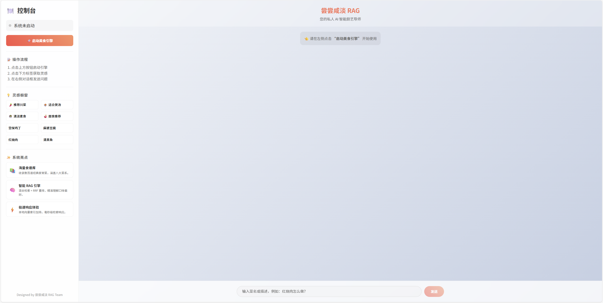

# 项目介绍

## 1. 项目概览

本项目是一个基于 **RAG (检索增强生成)** 技术的食谱问答系统。它旨在帮助用户通过自然语言查询食谱，获取详细的制作步骤、食材清单或菜品推荐。

### 核心特性
- **混合检索 (Hybrid Search)**：结合了向量检索 (Semantic Search) 和关键词检索 (BM25)，并使用 RRF (Reciprocal Rank Fusion) 算法进行重排，以提高检索准确性。
- **结构化数据处理**：针对 Markdown 格式的食谱数据，采用基于标题的结构化分块策略，保留了菜品的层级结构（如菜名、食材、步骤）。
- **智能查询处理**：
    - **查询路由 (Router)**：自动识别用户意图（列表推荐、详细做法、一般问答）。
    - **查询重写 (Rewrite)**：将模糊的用户查询（如“做菜”）转化为更具体的检索关键词。
- **多模型支持**：支持 DeepSeek 和 Moonshot (Kimi) 等兼容 OpenAI 接口的大语言模型。

## 2. 核心模块分析

### 2.1 系统入口 (`main.py`)
- **`RecipeRAGSystem` 类**：系统的核心控制器，负责协调各个模块。
- **初始化流程**：
    1. 加载环境变量和配置。
    2. 初始化数据准备、索引构建、生成集成等子模块。
    3. **构建知识库**：检查本地是否有已保存的向量索引，如果没有则从头构建（加载文档 -> 分块 -> 向量化 -> 保存）。
- **交互流程 (`run_interactive`)**：提供了一个命令行交互界面，支持流式输出。
- **问答逻辑 (`ask_question`)**：
    1. **路由**：判断查询类型。
    2. **重写**：优化查询语句（针对非列表类查询）。
    3. **检索**：提取元数据过滤器（分类、难度），执行混合检索。
    4. **生成**：根据路由类型调用不同的生成策略（列表生成、分步指导、基础回答）。

### 2.2 配置管理 (`config.py`)
- **`RAGConfig` 类**：使用 `dataclass` 定义配置项。
- **关键配置**：
    - `data_path`: 数据源路径 (默认 `./data/cook`)。
    - `index_save_path`: 向量索引保存路径。
    - `embedding_model`: 嵌入模型 (默认 `BAAI/bge-small-zh-v1.5`)。
    - `llm_model`: LLM 模型 (默认 `deepseek-chat`)。
    - `top_k`: 检索返回数量 (默认 3)。

### 2.3 RAG 核心模块 (`rag_modules/`)

#### A. 数据准备 (`data_preparation.py`)
- **功能**：负责加载 Markdown 文件并进行清洗和分块。
- **元数据增强**：
    - **分类**：根据文件路径自动映射分类（如 `meat_dish` -> 荤菜）。
    - **难度**：根据内容中的星级符号（★）自动判断难度等级。
- **分块策略**：使用 `MarkdownHeaderTextSplitter` 按 `#`, `##`, `###` 标题进行分割。这对于食谱这种结构化文本非常有效，避免了将一个步骤截断。
- **父子索引**：维护了子块 (Chunk) 到父文档 (完整食谱) 的映射，支持检索到片段后返回完整文档。

#### B. 索引构建 (`index_construction.py`)
- **功能**：负责将文本块转换为向量并建立索引。
- **工具**：
    - **Embeddings**: 使用 `HuggingFaceEmbeddings` 加载本地 BGE 模型。
    - **Vector Store**: 使用 `FAISS` (Facebook AI Similarity Search) 进行高效向量存储和检索。
- **持久化**：支持将 FAISS 索引保存到磁盘，避免每次启动重复构建。

#### C. 检索优化 (`retrieval_optimization.py`)
- **功能**：实现高级检索逻辑。
- **混合检索 (`hybrid_search`)**：
    1. **向量检索**：捕获语义相关性。
    2. **BM25 检索**：捕获关键词精确匹配。
    3. **RRF 重排**：使用倒数排名融合算法合并两者的结果，计算公式为 `1 / (k + rank)`。
- **元数据过滤 (`metadata_filtered_search`)**：支持在检索前/后应用分类和难度过滤，提高结果精确度。

#### D. 生成集成 (`generation_integration.py`)
- **功能**：与 LLM 交互，生成最终回答。
- **Prompt 模板**：
    - **基础回答**：通用问答模板。
    - **分步指导**：专门针对食谱的结构化模板（菜品介绍、食材、步骤、技巧）。
    - **查询重写**：包含规则和示例的 Few-shot Prompt。
    - **查询路由**：分类 Prompt。
    - **流式输出**：实现了 `_stream` 后缀的方法，提升用户体验。

## 3. 前端展示

本项目同时提供了一个简单的 Web 前端界面，方便非技术用户直接通过浏览器进行交互。如下图所示。


### 3.1 技术栈与结构
- **后端接口**：基于 `Flask`（见 `app2.py`），对外暴露问答接口与首页路由。
- **模板引擎**：使用 `Jinja2`，主页面模版为 `templates/index.html`。
- **静态资源**：前端样式和交互脚本位于 `static/style.css` 与 `static/script.js`。

### 3.2 页面功能
- **对话式问答区**：输入任意与做菜相关的问题（如“今晚适合做什么荤菜？”、“教我做鱼香肉丝”），前端会以对话形式展示模型回答。
- **历史记录/多轮体验**：前端以列表形式展示当前会话的问题与回答，便于连续追问和复制结果。
- **加载/状态提示**：在等待模型回复时展示加载动画或文字提示，提升使用体验。

### 3.3 启动方式
1. 确保已安装依赖：
    ```bash
    pip install -r requirements.txt
    ```
2. 启动 Web 服务（推荐使用 `app2.py`）：
    ```bash
    python app2.py
    ```
3. 在浏览器中访问 `http://127.0.0.1:5000`（或控制台输出的地址），即可使用图形化界面进行食谱问答。

### 3.4 环境变量与 `.env` 配置

在启动服务之前需要进行环境变量配置。项目通过 `python-dotenv` 在启动时自动加载根目录下的 `.env` 文件（见 `main.py` 中的 `load_dotenv()` 调用），用于读取大模型的 API Key 等敏感配置。

**必填环境变量：**
- `MOONSHOT_API_KEY`：Kimi / Moonshot 模型的 API Key（当前默认使用 `kimi-k2-0711-preview` 模型）。
    - 如果你改用 DeepSeek 模型，对应的环境变量为 `DEEPSEEK_API_KEY`（见 `rag_modules/generation_integration.py` 中注释部分），并需同步修改 `config.py` 中的 `llm_model`。

**`.env` 示例：**

```env
MOONSHOT_API_KEY=你的_Moonshot_API_Key
# 如需切换 DeepSeek，可改为：
# DEEPSEEK_API_KEY=你的_DeepSeek_API_Key
```

`.env` 文件需要与 `main.py` / `app2.py` 位于同一目录（项目根目录），且不要提交到版本库（可在 `.gitignore` 中忽略）。

## 4. 总结
该项目代码结构清晰，职责划分明确（数据-索引-检索-生成-前端展示）。它不仅仅是一个简单的 RAG Demo，还引入了许多生产环境所需的优化策略（如混合检索、查询理解、结构化分块），并配有易用的 Web 界面，是一个质量较高的 RAG 参考实现。
